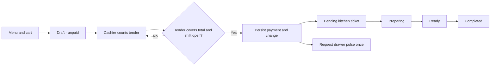
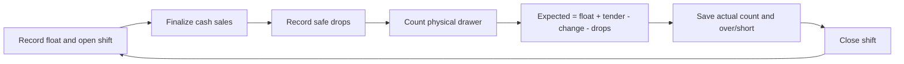

# MasaFlow cash data context

Applies to this upfront cash implementation. The revised payment specification is the primary requirement; the attached designs provide the visual and culinary examples. Cash receipt recognition is defined here to make the implementation explicit, not as a preexisting accounting policy.

## Money and record rules

Every money field is an integer number of USD cents. The service calculates prices from the current menu when creating an order; customer-supplied prices are never accepted. A draft preserves item names, options, and unit prices. Later price changes do not reprice an existing draft. Unavailable items or options block draft creation and payment, so an affected draft must be rebuilt before collecting cash.

| Record | Meaning and important fields |
| --- | --- |
| `Order` | One customer ticket. `id` is a UUID; `number` is an increasing MF reference. `status` describes fulfillment separately from `paymentStatus`. `items`, `subtotalCents`, `taxCents`, and `totalCents` are snapshots. `paymentId` links its one verified payment. |
| `LineItem` | One selected dish with integer `quantity` (1–99), dish/name snapshot, option snapshots, notes, `unitPriceCents`, and `lineTotalCents = quantity × unitPriceCents`. Exactly one available masa choice and up to two extras are required by the current sample menu. |
| `PaymentRecord` | One finalized upfront cash receipt linked to an order and open drawer shift. `totalCents` equals the order total; `changeCents = tenderedCents − totalCents`; tender must cover total. `paidAt` is the cash recognition time. `cashierId` is a supplied name, not an authenticated identity. |
| `CashDrawerShift` | One drawer session with a starting `floatCents`, opening cashier and timestamp. Closing saves `expectedCentsAtClose`, `actualCents`, `varianceCents`, closing time, and the supplied closing cashier name. Only one shift may be open. |
| `CashDrop` | A positive removal to the safe, attached to one open shift with amount, note, supplied cashier and timestamp. It cannot exceed the expected balance. |
| `InventoryItem` | Dish name, category, description, integer base price, image URL, availability and modifiers. Availability is an 86 flag; quantity/ingredient stock is not modeled. |
| `Audit` | Timestamped events for drafts, payments, kitchen transitions, float setup, cash drops, shift close, price changes, stock changes and drawer requests/results. |
| `HardwareJob` | Durable drawer-pulse reservation keyed by payment ID or an explicit manual-request ID. Result: simulated, sent, failed, unknown. It prevents a duplicate payment request from opening the drawer twice. |

## Cash and reporting definitions

| Measure | Exact rule and scope |
| --- | --- |
| Cash receipts / cash sales | Sum verified `PaymentRecord.totalCents` by `paidAt` in the selected America/Los_Angeles day/week/month/year. Payments must match their paid order's ID, payment ID, and total. Includes pending, preparing, ready and completed fulfillment. Excludes unpaid drafts; includes tax. |
| Net sales | Sum `Order.subtotalCents` for those same verified payments; excludes tax. No refund or void events are implemented. |
| Tax collected | Sum `Order.taxCents` for the same verified payment population. Current zero rate is unconfigured. |
| Transactions | Count those verified payments. Each finalized order has exactly one payment. |
| Average ticket | Cash receipts ÷ transactions. Display zero when no payments exist. |
| Top dishes | Sum purchased line quantities for the same paid-ticket population, ranked by quantity. |
| Expected drawer cash | Shift starting float + all shift cash tendered − all shift change returned − all shift cash drops. Equivalent to float + cash receipts − drops. Includes payments even if food is not yet complete. |
| Over/short | Actual physical cash count − expected cash at close. Positive is over, negative is short, zero is balanced. Later shifts cannot alter the saved audit. |
| Kitchen completion time | `completedAt − paidAt` for completed paid tickets. Includes wait between payment and preparation. Draft waiting time is excluded. |

## Upfront cash lifecycle

Hardware failure never removes or reverses a saved payment. Only a linked, verified paid cash record permits kitchen transitions. The server serializes mutations so two concurrent finalizations create one payment.

TypeScript interfaces: [orders and cash](shared/types/order.ts), [menu and availability](shared/types/menu.ts). Runtime validation lives in `apps/html/assets/masaflow-store.js` and is executed by the local service.
