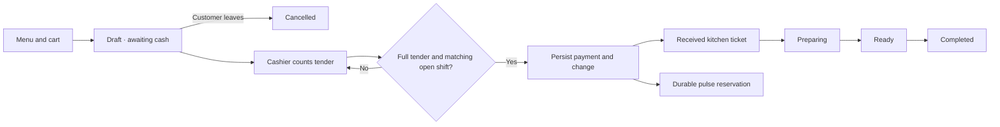
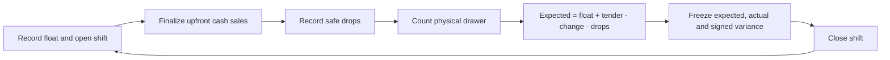

# Legacy cash data model (v0.2)

This document describes the preserved HTML/SSE runtime. For the active React/Socket.io suite, see [the v0.3 architecture](docs/REALTIME_ARCHITECTURE.md) and [typed contracts](shared/types/realtime.ts).

The revised upfront cash specification governs this implementation. The [reusable data context](docs/data-context/context-masaflow-cash/SKILL.md) contains the complete KPI dictionary, sources, filters, currencies, time windows and interpretation caveats.

## Money and record rules

New records store MXN integer centavos with currency snapshots. Legacy USD amounts remain exact USD cents without conversion. Menu prices are authoritative at draft creation. Names, modifier prices, line totals and tax are immutable snapshots. Unavailable dishes or modifiers block payment.

Order IDs are UUIDs. A persisted submission ID and normalized fingerprint (including phone, removed toppings and the on-the-side choice) make identical retries return the same ticket and reject conflicting reuse. A line's `removed` toppings must come from the dish's `included` list and never change the price; `onTheSide` asks for the rest on the side. `customerPhone` is optional contact text. Payment status is separate from fulfillment. A unique verified payment links the order and its shift. Kitchen transitions require verified payment and stamp `preparingAt`, `readyAt` and `completedAt`. An unpaid draft can be `cancelled`; a paid order cannot, so drawer math is unaffected. Deleting a dish removes it from the menu only: paid receipts keep their snapshots and still verify, while an unpaid draft containing it cannot be paid until rebuilt. Menu audit entries are split by kind (`menu_price`, `menu_stock`, `menu_add`, `menu_edit`, `menu_delete`, `modifier_edit`) and carry a `data` object with the dish id and before/after values, which lets the menu history offer an undo; a save that changes nothing writes no entry. Closed balances and signed variance are frozen.

TypeScript interfaces: [orders and cash](shared/types/order.ts), [menu](shared/types/menu.ts). [The cash engine](assets/masaflow-store.js) owns validation and serialized transactions; [analytics](shared/analytics.js) owns the reporting transformations.

## Upfront cash lifecycle

Persistence failure does not dispatch a ticket. Drawer failure does not remove a payment. Lost or duplicate responses cannot create another verified payment or repeat a reserved pulse.

## Drawer lifecycle

## Analytics API

GET `/api/analytics` normalizes tab (or legacy view), period, date and lang. It returns revision, observation time, currency, timezone, definitions, quality counts, sales and Operations evidence. Sales use Mexico City paidAt; the live queue spans all dates. Pickup median uses today's completedAt, including overnight payments, and reports the valid sample count. Empty averages and medians are null in the API and “—” in the interface.

`quality.excludedReceipts` counts unverified payment rows plus paid orders with no linked payment. `quality.invalidCompletionTimes` counts verified completed tickets with missing, impossible or negative completion durations. `quality.invalidAudits` counts closed shifts with inconsistent saved expected/actual/variance values, ambiguous IDs, unsupported currency or invalid closing timestamps. These counts cover the committed store, independently of Sales filters. Closed audits retain their original expected cash and signed variance; the latest audit card selects the most recent valid close without recomputing historical balances.

POST `/api/analytics/summary` accepts displayed scope, locale and revision, recomputes verified aggregates and rejects stale requests. [Summary generation](shared/sales-summary.js) sends aggregates and definitions only, validates references and renders authoritative numbers. The browser accepts matching responses atomically; earlier filter requests and older revisions cannot overwrite displayed evidence.
